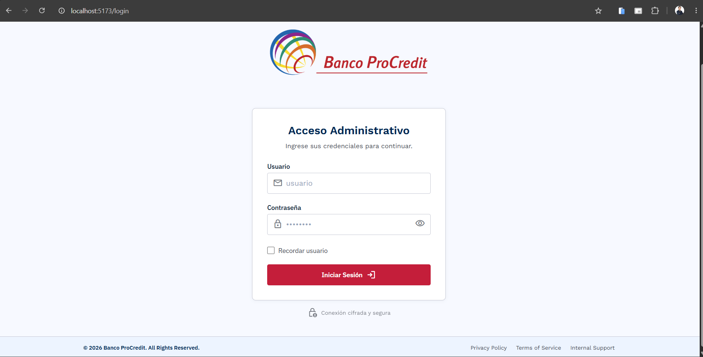
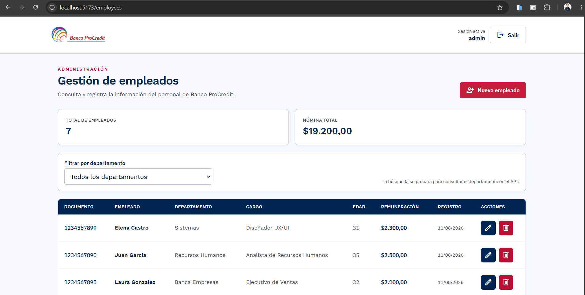
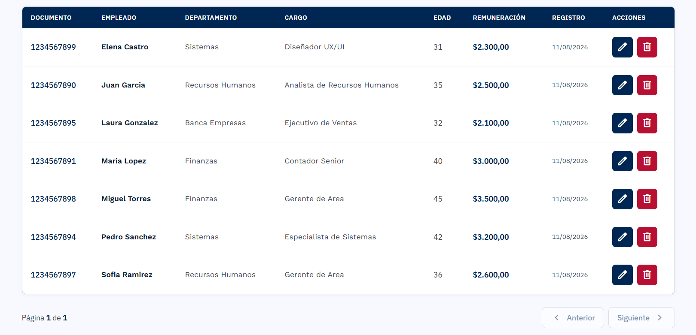
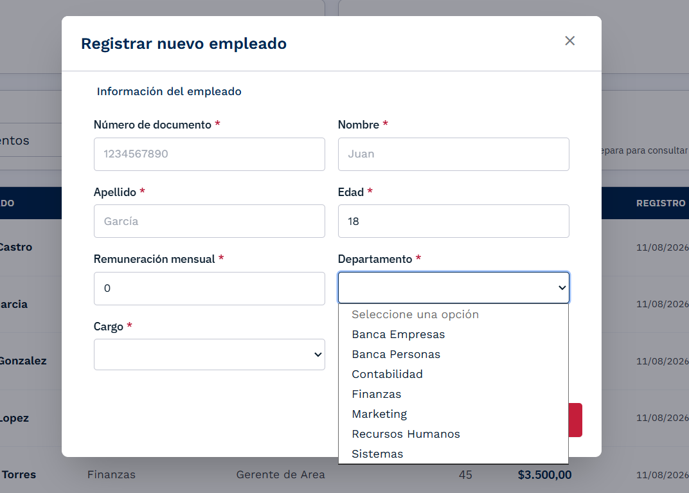
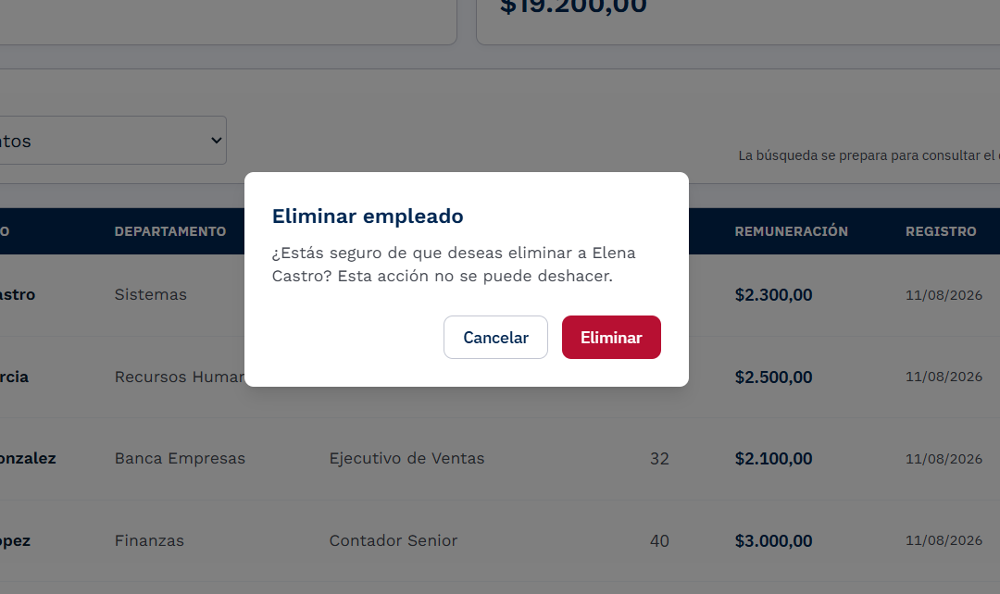

# 🏦 Banco ProCredit - Sistema de Gestión de Empleados

[]()
[]()
[]()

Sistema completo de gestión de empleados para Banco ProCredit, desarrollado con arquitectura hexagonal, LINQ, paginación y autenticación JWT.

---

## 📋 Tabla de Contenidos

- [Características](#características)
- [Arquitectura](#arquitectura)
- [Tecnologías](#tecnologías)
- [Requisitos Previos](#requisitos-previos)
- [Instalación](#instalación)
  - [Base de Datos](#1-base-de-datos)
  - [Backend](#2-backend)
  - [Frontend](#3-frontend)
- [Ejecución](#ejecución)
- [Guía de Uso](#guía-de-uso)
- [Estructura de Carpetas](#estructura-de-carpetas)
- [API Endpoints](#api-endpoints)
- [Pantallas del Frontend](#pantallas-del-frontend)
- [Solución de Problemas](#solución-de-problemas)
- [Contribución](#contribución)

---

## ✨ Características

### Backend

✅ **Arquitectura Hexagonal** - Separación de capas: Domain, Application, Infrastructure, API
✅ **Autenticación JWT** - Bearer Token con usuario de prueba (usuario/123456)
✅ **LINQ Avanzado** - Consultas con `.Where()`, `.OrderBy()`, `.Include()`, `.Skip()`, `.Take()`
✅ **Paginación Completa** - Endpoints paginados con información de páginas
✅ **Validaciones** - FluentValidation para DTOs
✅ **Mappeo Automático** - AutoMapper para Entity ↔ DTO
✅ **CORS Configurado** - Permite requests desde frontend

### Frontend

✅ **React 19 + Tailwind** - Interfaz moderna y responsiva
✅ **Gestión de Estado** - Context API con custom hooks
✅ **Paginación Interactiva** - Tabla con navegación de páginas
✅ **CRUD Completo** - Crear, Leer, Actualizar, Eliminar empleados
✅ **Autenticación Segura** - JWT en cookies (HttpOnly capable)
✅ **Formularios Reactivos** - React Hook Form + Zod validation
✅ **Confirmación de Acciones** - Diálogos para operaciones críticas

### Base de Datos

✅ **SQL Server** - Relacional, normalizado
✅ **3 Tablas Principales** - Empleados, Departamentos, Cargos
✅ **Stored Procedures** - SP_GetEmpleados, SP_GetEmpleadosPorDepartamento
✅ **Índices de Optimización** - Para consultas rápidas
✅ **Constraints** - Validaciones a nivel BD (edad, remuneración)

---

## 🏗️ Arquitectura

```
┌─────────────────────────────────────────────────────────────┐
│                   FRONTEND (React 19)                       │
│  ├─ Login Screen                                            │
│  ├─ Employee List (Paginado)                               │
│  ├─ Add/Edit Employee Modal                                │
│  └─ Confirm Delete Dialog                                  │
└────────────────────┬────────────────────────────────────────┘
                     │ HTTP/HTTPS REST API
                     │ (Port 7139)
┌────────────────────▼────────────────────────────────────────┐
│              BACKEND (C# .NET 10)                           │
│  ├─ API Layer (Controllers)                                │
│  ├─ Application Layer (Services, DTOs, Validators)        │
│  ├─ Infrastructure Layer (Repositories, DbContext)        │
│  └─ Domain Layer (Entities, Interfaces)                   │
└────────────────────┬────────────────────────────────────────┘
                     │ SQL Queries
                     │
┌────────────────────▼────────────────────────────────────────┐
│         BASE DE DATOS (SQL Server)                          │
│  ├─ Empleados (10 registros de ejemplo)                   │
│  ├─ Departamentos (7 registros)                            │
│  ├─ Cargos (8 registros)                                   │
│  └─ Índices y Constraints                                  │
└─────────────────────────────────────────────────────────────┘
```

---

## 🛠️ Tecnologías

### Backend

- **Framework:** .NET 10.0
- **ORM:** Entity Framework Core
- **Validación:** FluentValidation
- **Mapeo:** AutoMapper
- **Autenticación:** JWT Bearer Tokens
- **Database:** SQL Server

### Frontend

- **Librería:** React 19
- **Lenguaje:** TypeScript
- **Estilos:** Tailwind CSS
- **HTTP Client:** Axios
- **Formularios:** React Hook Form + Zod
- **Gestor de Estado:** Context API

### Base de Datos

- **Motor:** SQL Server 2019+
- **Tipo:** Relacional
- **Acceso:** SQL Server Management Studio

---

## 📦 Requisitos Previos

Antes de comenzar, asegúrate de tener instalado:

- **SQL Server 2019 o superior** (Community, Express, Standard)
- **SQL Server Management Studio (SSMS)**
- **.NET 10 SDK** - [Descargar](https://dotnet.microsoft.com/en-us/download/dotnet/10.0)
- **Node.js 18+** - [Descargar](https://nodejs.org/)
- **npm 9+** (viene con Node.js)
- **Visual Studio 2022 o VS Code**

### Verificar instalación

```bash
# Verificar .NET
dotnet --version

# Verificar Node.js
node --version
npm --version

# Verificar SQL Server (en SQL Server Management Studio)
SELECT @@VERSION;
```

---

## 🚀 Instalación

### 1. Base de Datos

#### Paso 1.1: Abre SQL Server Management Studio

1. Busca **SQL Server Management Studio** en el menú Inicio
2. Abre la aplicación
3. **Server name:** `localhost\SQLEXPRESS` (o tu instancia SQL Server)
4. **Authentication:** Windows Authentication
5. Click en **Connect**

#### Paso 1.2: Ejecuta el script de BD

1. En SSMS, click en **File** → **Open** → **File**
2. Selecciona: `BancoProcredit_Script_Completo_Final.sql`
3. **Ejecuta** el script (F5 o botón Execute)
4. Verás el mensaje: **"Command(s) completed successfully"** ✅

#### Paso 1.3: Verifica la BD

```sql
-- Ejecuta esta query para verificar:
USE BancoProcreditDB;

-- Ver tablas
SELECT * FROM Departamentos;
SELECT * FROM Cargos;
SELECT * FROM Empleados;

-- Ver información de empleados completa
EXEC SP_GetEmpleados;
```

**Si ves 10 empleados** ✅ La BD está lista.

---

### 2. Backend

#### Paso 2.1: Abre Visual Studio 2022

1. **File** → **Open** → **Project/Solution**
2. Selecciona: `BancoProcreditBackend.sln`
3. Espera a que cargue el proyecto

#### Paso 2.2: Configura la Connection String

En **BancoProcredit.API**, abre: `appsettings.json`

```json
{
  "ConnectionStrings": {
    "DefaultConnection": "Server=localhost\\SQLEXPRESS;Database=BancoProcreditDB;Integrated Security=true;TrustServerCertificate=true;"
  },
  "Jwt": {
    "Secret": "BancoProcreditSecretKeyVeryLongAndSecureKeyFor32Bytes",
    "Issuer": "BancoProcreditAPI",
    "Audience": "BancoProcreditClient",
    "ExpireMinutes": 60
  }
}
```

**Cambiar si es necesario:**

- `Server`: Tu instancia SQL Server
- `Database`: Debe ser `BancoProcreditDB`
- `TrustServerCertificate`: `true` si usas certificado auto-firmado

#### Paso 2.3: Restaura dependencias

```bash
cd D:\Directorios\Documents\Trabajo Procredit\PruebaT-cnica-BancoProCredit\BACKEND

dotnet restore
```

#### Paso 2.4: Compila el proyecto

En Visual Studio:

```
Build → Build Solution (Ctrl+Shift+B)
```

Debe salir: **"Build succeeded"** ✅

#### Paso 2.5: Ejecuta el backend

En Visual Studio:

```
Debug → Start Without Debugging (Ctrl+F5)
```

O en PowerShell:

```bash
dotnet run --project BancoProcredit.API
```

**Salida esperada:**

```
info: Microsoft.Hosting.Lifetime[14]
      Now listening on: https://localhost:7139
      Now listening on: http://localhost:5000
info: Microsoft.Hosting.Lifetime[14]
      Application started. Press Ctrl+C to exit
```

✅ **Backend corriendo en https://localhost:7139**

---

### 3. Frontend

#### Paso 3.1: Abre terminal en la carpeta del frontend

```bash
cd banco-procredit-frontend
```

#### Paso 3.2: Instala dependencias

```bash
npm install
```

Espera a que termine (puede tardar 2-3 minutos).

#### Paso 3.3: Copia el archivo .env (si existe)

Si hay `.env`, cópialo a `.env`:

```bash
cp .env.example .env
```

**Contenido del .env:**

```
VITE_API_BASE_URL=https://localhost:7139/api
```

#### Paso 3.4: Ejecuta el frontend

```bash
npm run dev
```

**Salida esperada:**

```
VITE v4.x.x  ready in xxx ms

➜  Local:   http://localhost:5173/
```

✅ **Frontend corriendo en http://localhost:5173**

---

## ⚡ Ejecución

### Orden de levantamiento recomendado

1. **Base de Datos** (SQL Server)
   - Verificar que esté corriendo
   - Script ejecutado

2. **Backend** (.NET API)

   ```bash
   dotnet run --project BancoProcredit.API
   ```

   - Escuchar: https://localhost:7139

3. **Frontend** (React)

   ```bash
   npm run dev
   ```

   - Abrir: http://localhost:5173

---

## 📖 Guía de Uso

### Login

1. Accede a: http://localhost:5173
2. Usa el usuario preconfigurado
3. **Usuario:** `admin@admin.com`
4. **Contraseña:** `Flerovio`
5. Click en **Iniciar Sesión**

### Gestionar Empleados

#### Ver lista de empleados

- Tabla muestra 10 empleados por página
- Datos: Documento, Nombre, Departamento, Cargo, Edad, Remuneración

#### Filtrar por departamento

1. Selecciona departamento en dropdown
2. La tabla se recarga con los empleados de ese departamento
3. Paginación se reinicia a página 1

#### Crear empleado

1. Click en **"Nuevo Empleado"** (botón verde)
2. Completa el formulario:
   - Número de Documento (único)
   - Nombre y Apellido
   - Edad (18-65)
   - Remuneración (> 0)
   - Selecciona Departamento y Cargo
3. Click en **"Registrar"**

#### Editar empleado

1. En la fila del empleado, click en icono **lápiz (Edit)**
2. Se abre modal con datos precargados
3. Modifica los datos
4. Click en **"Actualizar"**
5. Modal se cierra y tabla se recarga

#### Eliminar empleado

1. En la fila del empleado, click en icono **basura (Delete)**
2. Se abre confirmación: "¿Estás seguro...?"
3. Click en **"Eliminar"**
4. Empleado se marca como inactivo (borrado lógico)

#### Navegar páginas

- Botones "Anterior" y "Siguiente" en la parte inferior
- Muestra: "Página X de Y"

### Cierre de Sesión

- Click en nombre de usuario (arriba a la derecha)
- Click en **"Cerrar Sesión"**

---

## 📁 Estructura de Carpetas

### Backend

```
BACKEND/
├── BancoProcredit.API/                    # Layer Presentación
│   ├── Controllers/
│   │   ├── AuthController.cs
│   │   ├── EmpleadosController.cs
│   │   ├── DepartamentosController.cs
│   │   └── CargosController.cs
│   ├── Program.cs                         # Configuración principal
│   ├── appsettings.json                   # Conexión y JWT
│   └── BancoProcredit.API.csproj
│
├── BancoProcredit.Application/            # Layer Aplicación
│   ├── DTOs/
│   │   ├── EmpleadoDTO.cs
│   │   ├── CreateEmpleadoDTO.cs
│   │   ├── DepartamentoDTO.cs
│   │   ├── CargoDTO.cs
│   │   ├── LoginRequestDTO.cs
│   │   ├── LoginResponseDTO.cs
│   │   └── PaginatedResponseDTO.cs
│   ├── Services/
│   │   ├── IEmpleadoService.cs
│   │   ├── EmpleadoService.cs
│   │   ├── IDepartamentoService.cs
│   │   ├── DepartamentoService.cs
│   │   ├── ICargoService.cs
│   │   └── CargoService.cs
│   ├── Validators/
│   │   └── EmpleadoValidator.cs
│   ├── Mappings/
│   │   └── MappingProfile.cs
│   └── BancoProcredit.Application.csproj
│
├── BancoProcredit.Domain/                 # Layer Dominio
│   ├── Entities/
│   │   ├── Empleado.cs
│   │   ├── Departamento.cs
│   │   └── Cargo.cs
│   ├── Interfaces/
│   │   ├── IEmpleadoRepository.cs
│   │   ├── IDepartamentoRepository.cs
│   │   └── ICargoRepository.cs
│   ├── Exceptions/
│   │   └── DomainException.cs
│   └── BancoProcredit.Domain.csproj
│
├── BancoProcredit.Infrastructure/         # Layer Infraestructura
│   ├── Persistence/
│   │   ├── Data/
│   │   │   └── BancoProcreditContext.cs
│   │   └── Repositories/
│   │       ├── EmpleadoRepository.cs
│   │       ├── DepartamentoRepository.cs
│   │       └── CargoRepository.cs
│   ├── Authentication/
│   │   ├── JwtTokenProvider.cs
│   │   ├── AuthService.cs
│   │   └── IAuthService.cs
│   ├── Configuration/
│   │   ├── AuthenticationConfiguration.cs
│   │   └── ServiceConfiguration.cs
│   └── BancoProcredit.Infrastructure.csproj
│
└── BancoProcreditBackend.sln
```

### Frontend

```
banco-procredit-frontend/
├── src/
│   ├── features/
│   │   ├── auth/
│   │   │   ├── components/
│   │   │   │   ├── LoginForm.tsx
│   │   │   │   └── PasswordInput.tsx
│   │   │   ├── context/
│   │   │   │   └── AuthProvider.tsx
│   │   │   ├── pages/
│   │   │   │   └── LoginPage.tsx
│   │   │   ├── services/
│   │   │   │   └── auth.service.ts
│   │   │   └── types/
│   │   │       └── auth.types.ts
│   │   │
│   │   └── employees/
│   │       ├── components/
│   │       │   ├── EmployeeTable.tsx
│   │       │   ├── EmployeeModal.tsx
│   │       │   ├── EmployeeForm.tsx
│   │       │   ├── EmployeeFilters.tsx
│   │       │   ├── Pagination.tsx
│   │       │   └── ConfirmDialog.tsx
│   │       ├── context/
│   │       │   └── EmployeesProvider.tsx
│   │       ├── pages/
│   │       │   └── EmployeesPage.tsx
│   │       ├── services/
│   │       │   └── employees.service.ts
│   │       ├── types/
│   │       │   └── employee.types.ts
│   │       └── constants/
│   │           └── employeeFormData.const.ts
│   │
│   ├── shared/
│   │   ├── components/
│   │   │   ├── Header.tsx
│   │   │   ├── Modal.tsx
│   │   │   ├── Alert.tsx
│   │   │   ├── Input.tsx
│   │   │   ├── Spinner.tsx
│   │   │   └── dynamic-form/
│   │   │       └── DynamicFormField.tsx
│   │   ├── services/
│   │   │   └── api.ts
│   │   ├── utils/
│   │   │   ├── cookieUtils.ts
│   │   │   ├── formatCurrency.ts
│   │   │   └── formatDate.ts
│   │   └── hooks/
│   │       ├── useLocalStorage.ts
│   │       └── useAuth.ts
│   │
│   ├── App.tsx
│   ├── main.tsx
│   └── styles/
│       └── globals.css
│
├── index.html
├── package.json
├── tsconfig.json
├── tailwind.config.js
├── vite.config.ts
└── .env
```

### Base de Datos

```
Scripts SQL/
├── BancoProcredit_Script_Completo_Final.sql
│   ├── CREATE DATABASE BancoProcreditDB
│   ├── CREATE TABLE Departamentos
│   ├── CREATE TABLE Cargos
│   ├── CREATE TABLE Empleados
│   ├── CREATE INDEXES
│   ├── CREATE SP_GetEmpleados
│   ├── CREATE SP_GetEmpleadosPorDepartamento
│   └── INSERT Datos de ejemplo
└── INSTRUCCIONES_EJECUTAR_SCRIPT.md
```

---

## 🔌 API Endpoints

### Autenticación

```
POST /api/auth/login
Request:  { "username": "usuario", "password": "123456" }
Response: { "success": true, "token": "...", "expiresAt": "..." }
```

### Empleados

```
GET    /api/empleados?pageNumber=1&pageSize=10
GET    /api/empleados/{id}
GET    /api/empleados/departamento/{deptId}?pageNumber=1&pageSize=10
POST   /api/empleados
PUT    /api/empleados/{id}
DELETE /api/empleados/{id}

Headers: Authorization: Bearer {token}
```

### Departamentos

```
GET /api/departamentos
GET /api/departamentos/{id}

Headers: Authorization: Bearer {token}
```

### Cargos

```
GET /api/cargos
GET /api/cargos/{id}

Headers: Authorization: Bearer {token}
```

**Ver más:** Ver archivo `BancoProcredit_Postman_v2_Paginado.json`

---

## 🎨 Pantallas del Frontend

### Pantalla de Login



### Pantalla Principal - Gestión de Empleados



#### Tabla de Empleados



### Modal - Nuevo/Editar Empleado



### Diálogo - Confirmar Eliminación



---

## 🔧 Solución de Problemas

### Backend no conecta con BD

**Problema:** "A network-related or instance-specific error"

**Solución:**

1. Verifica SQL Server está corriendo:
   ```powershell
   Get-Service -Name MSSQL$SQLEXPRESS | Select-Object Status
   ```
2. Verifica la connection string en `appsettings.json`
3. Prueba con SSMS conectar manualmente

### Frontend no conecta con API

**Problema:** CORS error o "Connection refused"

**Solución:**

1. Verifica que backend esté corriendo en https://localhost:7139
2. Revisa la variable `VITE_API_BASE_URL` en `.env`
3. Limpia caché del navegador (Ctrl+Shift+Del)

### Token expirado

**Problema:** "401 Unauthorized"

**Solución:**

1. Cierra sesión
2. Vuelve a hacer login
3. Token se renueva automáticamente (1 hora)

### Base de datos no se crea

**Problema:** Script SQL falla

**Solución:**

1. Verifica que hayas descomentado la línea `CREATE DATABASE`
2. Ejecuta el script nuevamente
3. Verifica permisos en SQL Server

---

## 📚 Documentación Adicional

- **Cambios Frontend:** Ver `CAMBIOS_FRONTEND.md`
- **Cambios Cookies:** Ver `CAMBIOS_COOKIES.md`
- **Instrucciones BD:** Ver `INSTRUCCIONES_EJECUTAR_SCRIPT.md`
- **Resumen Técnico:** Ver `RESUMEN_PRUEBA_TECNICA.md`

---

## 🤝 Contribución

Para contribuir al proyecto:

1. Crea una rama: `git checkout -b feature/nueva-funcionalidad`
2. Haz commit: `git commit -m "Agrega nueva funcionalidad"`
3. Push a la rama: `git push origin feature/nueva-funcionalidad`
4. Abre un Pull Request

---

## 📄 Licencia

Este proyecto es propiedad de Banco ProCredit. Uso exclusivo interno.

---

## 📞 Soporte

Para soporte técnico, contacta al equipo de desarrollo de Banco ProCredit.

---

## 🎯 Checklist de Verificación

- [ ] SQL Server está corriendo
- [ ] BD `BancoProcreditDB` creada con datos
- [ ] Backend compila sin errores
- [ ] Backend levantado en https://localhost:7139
- [ ] Frontend instala dependencias
- [ ] Frontend levantado en http://localhost:5173
- [ ] Login funciona (usuario/123456)
- [ ] Tabla de empleados muestra datos
- [ ] Paginación funciona
- [ ] Crear/Editar/Eliminar empleados funciona
- [ ] Filtro por departamento funciona

✅ **Cuando todo esté verde, ¡listo para usar!**

---

**Versión del Documento:** 2.1
**Última Actualización:** Agosto 14, 2026
**Autor:** Adrian Bastidas
